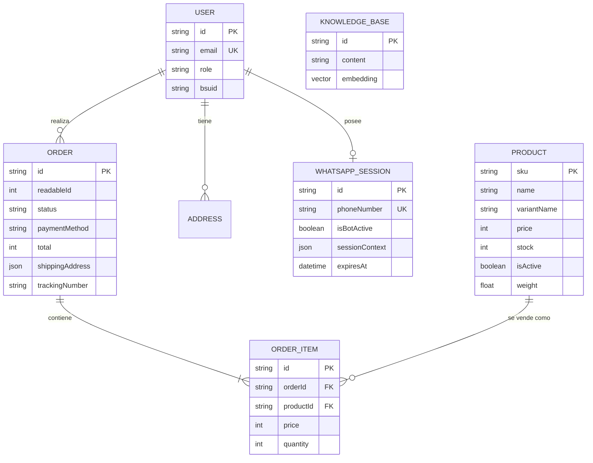

# KAIU Natural Living - Documentación Maestra Arquitectónica (V.2026)

Este documento es el **Whitepaper Técnico Definitivo** del proyecto KAIU. Está diseñado para ser asimilado por Ingenieros de Software Senior, Arquitectos Cloud, o Agentes de Inteligencia Artificial que requieran el 100% del contexto operativo, bases de datos y separaciones de capa lógica antes de intervenir el código.

---

## 🖥 1. Separación de Capas Frontend (BFF Pattern)

El proyecto Vercel (React/Vite) compila una sola SPA (Single Page Application), pero lógicamente está bifurcado por el enrutador (`react-router-dom`) en dos ecosistemas que no cruzan datos:

### 🟢 A. Capa Cliente (Pública - Tienda e-Commerce)

- **Enrutamiento:** Rutas en la raíz (ej: `/`, `/catalogo`, `/checkout`).
- **Funcionalidades:**
  - Vitrina dinámica que hidrata su estado leyendo de `GET /api/products` (Data Pública).
  - Motor de Carrito basado en memoria local (`CartContext`).
  - **Pasarela de Pago Wompi integrada mediante IFrame/Widget** protegido por `VITE_WOMPI_PUB_KEY` para pre-autorizar tarjetas de crédito o Nequi.
- **Seguridad:** No requiere autenticación. Genera peticiones anónimas al motor de productos.

### 🔴 B. Capa Admin (Privada - Orquestador KAIU)

- **Enrutamiento:** Protegido bajo el layout `/dashboard/*`.
- **Seguridad:** Requiere Login (JWT). El backend verifica un PIN contra la variable estática JSON `KAIU_ADMIN_USERS`. El token Bearer es obligatorio en todas estas rutas.
- **Topología de Módulos (Los 5 Pilares del Dashboard):**
  1. **Resumen Ejecutivo (`/dashboard/`):** Componente `OverviewPanel.tsx`. Muestra KPIs financieros (Ticket promedio, Total de órdenes) y gráficas en React Recharts extrayendo estadísticas del backend.
  2. **Órdenes y Envíos (`/dashboard/orders`):** Componente `OrdersPanel.tsx`. Central de logística. Monitorea cambios de estado post-Wompi (`PAID`, `SHIPPED`), imprime guías de transporte PDF haciendo proxy con la API oficial y audita la base de datos `Order`.
  3. **Inventario (`/dashboard/inventory`):** Componente `InventoryManager.tsx`. Maestro CRUD de `Products` y sus variantes. Controla precios, stock, dimensiones y "Soft Delete" seguro de variantes.
  4. **Conversaciones Inteligentes (`/dashboard/chats`):** Componentes `ChatList` y `ChatView`. Terminal de WebSockets (`Socket.io`). Observa en vivo qué responde la IA a cada celular, e incluye el botón **"Tomar Control (Handover)"** para mutear a Claude y hablar de humano a humano.
  5. **Cerebro RAG & Conocimiento (`/dashboard/knowledge`):** Componente `KnowledgePanel.tsx`. Entrena al LLM inyectando manuales en texto que son divididos en "Chunks" y casteados a vectores multidimensionales en `pgvector`.

---

## 🗄️ 2. Topología Estructural de Bases de Datos (Prisma Schema)

El cerebro de persistencia es PostgreSQL 15, estructurado a través de **Prisma ORM**. A continuación se presenta el Diagrama Entidad-Relación (DER) exacto mapeado para KAIU V.2026:

### Diccionario de Datos (Tablas y Campos Nucleares)

El sistema opera bajo 6 entidades centrales que interactúan de la siguiente manera:

#### 1. `USER` (Usuarios y Roles)

Gestiona la autenticación y nivel de acceso (RBAC) para el Dashboard Admin, diferenciando a los clientes finales ("Gents") de los operadores del negocio.

- **`email` / `password`:** Credenciales de ingreso (Hash Bcrypt).
- **`role` (Enum):** Control de UI. Puede ser `CUSTOMER`, `ADMIN` (Acceso Total), `WAREHOUSE` (Inventario/Órdenes), o `SUPPORT` (Solo Chats).
- **`bsuid`:** Identificador Único de Negocio de Meta Cloud, útil para asociar un celular corporativo WA con un usuario de base de datos.

#### 2. `PRODUCT` (Inventario y Catálogo)

El corazón transaccional del e-commerce. Sus datos se hidratan en el dashboard y se leen vía API al pintar el Home público.

- **`sku` (PK):** Código Universal. Pieza clave para el "Tool Calling" de Claude, quien le dice al backend: "Cotizame el SKU X".
- **`stock` y `price`:** Campos financieros puros. El precio siempre se almacena en **Centavos de Peso (Cop)** para evitar errores de coma flotante en pasarelas de pago.
- **`weight` (y Metadatos Volumétricos):** Variables `float` obligatorias que exige "Coordinadora" (o transportadoras nacionales colombianas) para emitir cobros automáticos de envíos vía API.
- **`isActive`:** Interruptor Lógico que permite realizar "Soft Deletes" para retirar productos del catálogo sin dañar el historial relacional de facturas antiguas.

#### 3. `ORDER` y `ORDER_ITEM` (Transacciones y Logística)

Entidades Inmutables diseñadas para bloquear cambios post-venta y generar Guías de Envío legalmente válidas.

- **`status` (Enum Crítico):** Motor de estado (`PENDING` -> `CONFIRMED` -> `SHIPPED`). Este valor lo dicta el webhook blindado criptográficamente de la pasarela **Wompi**. Ningún humano puede marcar arbitrariamente como "Pagado" si la API de Wompi no manda el evento.
- **`paymentMethod`:** Codifica la procedencia del pago (`WOMPI` para el checkout online, `COD` para los pedidos telefónicos o por WhatsApp contra-entrega).
- **`shippingAddress` (JSON estático):** Una vez la persona compra, la dirección a la que pidió `((Calle X, Apto Y))` se inyecta como un JSON duro. No es relacional. Esto es por diseño: si el usuario se muda de casa en 6 meses, su factura del pasado debe seguir registrando la dirección original inalterada.
- **`trackingNumber`:** Número de guía asignado por la transportadora, imprimible luego por etiqueta térmica PDF en el Dashboard.

#### 4. `WHATSAPP_SESSION` (Orquestador Conversacional)

El semáforo principal del flujo de atención al cliente de Meta.

- **`phoneNumber`:** Número con formato internacional (Ej: `57300123...`) que identifica la sesión.
- **`isBotActive` (Boolean):** **El interruptor más importante de la empresa.** Si está activo, el servidor NodeJS deja que la IA de Anthropic responda los SMS que llegan al webhook. Si cambia a false ("Handover Human"), el Bot se silencia para cederle el chat de forma remota a soporte humano.
- **`sessionContext` (JSON):** Memoria efímera. Almacena en string crudo el historial relacional de Langchain sobre la charla del cliente antes de los cortes HTTP (ej. "¿De qué aceite veníamos hablando?").
- **`expiresAt`:** Restricción propia de Meta que obliga a responder interacciones antes de las 24 Horas comerciales.

#### 5. `KNOWLEDGE_BASE` (El Cerebro RAG de Memoria Vectorial)

La tabla "Mágica". En lugar de un modelo If/Else, el KAIU se apoya aquí para volverse inteligente sobre manuales de políticas de envío o ingredientes botánicos.

- **`embedding` (`Unsupported("vector(1536)")`):** El backend extrae el texto de un PDF ("Los envíos a Pasto demoran 2 días"), le envía eso al LLM API, nos devuelve un tensor matemático de 1536 flotantes, y Prisma lo guarda nativamente gracias a `pgvector`. Cuando llega la duda, el backend lanza una ecuación de `Similitud del Coseno (<=>)` por SQL Puro contra todos los vectores para hallar la respuesta ideal.

---

## ⚡ 3. El Pipeline Asíncrono Híbrido (Data Workflow)

Para proteger a la Base de Datos y al Server de Node de morir por picos de tráfico en pautas de Facebook Ads (Millones de Webhooks simultáneos), el flujo de entrada es asíncrono.

1.  **Recepción:** Meta emite el mensaje JSON a `POST /api/whatsapp/webhook`.
2.  **Validación de Firma:** Node calcula el Hash `x-hub-signature-256` usando la llave maestra privada de Meta (`WHATSAPP_APP_SECRET`). Cortafuegos anti-inyección.
3.  **Buffer en Memoria (Redis):** Si pasa, se inyecta en milisegundos a la cola BullMQ e inmediatamente Node responde `200 OK` a Meta (Requisito estricto de Meta para evitar Timeouts).
4.  **Ejecución Pesada (Worker Thread):** Un Worker secundario de BullMQ saca el ticket. Descarga historial de Prisma, arma el grafo contextual (LangChain), e invoca la API `claude-3-5-sonnet`.
5.  **Invocación de Herramientas (Tool Calling):** Claude puede retornar JSON en lugar de texto (Ej: `{"action": "searchInventory", "sku": "LAV-1"}`). El Worker atrapa esto, escanea la tabla `Product` y retorna los precios exactos al cerebro LLM.
6.  **Despacho Dual:** Una vez Claude decide el texto final:
    - Se hace POST a Meta Graph API v21 para enviar el SMS al celular físico del usuario (Usa `WHATSAPP_ACCESS_TOKEN`).
    - Se dispara el Web Socket `io.emit()` para que las pantallas de Vercel/React del administrador reciban la burbuja verde tipo WhatsApp Web al instante.

---

## 🔐 4. Matriz Criptográfica y Variables de Entorno

### Entorno Vercel (Front) `.env.production`

Ningún secreto profundo va aquí. El código de React es visible desde F12 (Inspect).

- `VITE_API_URL`: Enlaza Vercel con la IP del Servidor API (Render).
- `VITE_WOMPI_PUB_KEY`: Pública mercantil.

### Entorno Render (Servidor) `.env`

Bóveda fuerte. No accesibles desde afuera.

- `DATABASE_URL` (Conector Prisma PostgreSQL transaccional)
- `REDIS_URL` (Motor Broker de Mensajes para BullMQ)
- `ANTHROPIC_API_KEY` (Facturación de API LLM Claude)
- `WHATSAPP_PHONE_ID` / `WHATSAPP_ACCESS_TOKEN` / `WHATSAPP_VERIFY_TOKEN` (Cerebro Conector WA)
- `WHATSAPP_APP_SECRET` (Llave de firma HMAC SHA-256 de webhooks)
- `WOMPI_EVENTS_SECRET` / `WOMPI_INTEGRITY_SECRET` (Validación SHA-256 para prevenir que cibercriminales simulen que ya pagaron un pedido).
- `SUPABASE_URL` / `SUPABASE_SERVICE_ROLE_KEY` (Acceso root de almacenamiento para Subir Imagenes eludiendo límites RLS de Postgres).

### Instrucciones de Re-Despliegue Local Rápido

- Arrancar DB: `npx prisma db push`
- Arrancar API Node: `npm run api` (Puerto 3001)
- Arrancar Vite: `npm run dev` (Puerto 3000)
- Simulador Webhook (Para codear sin Meta Cloud): `node scripts/simulate_webhook_test.js`
